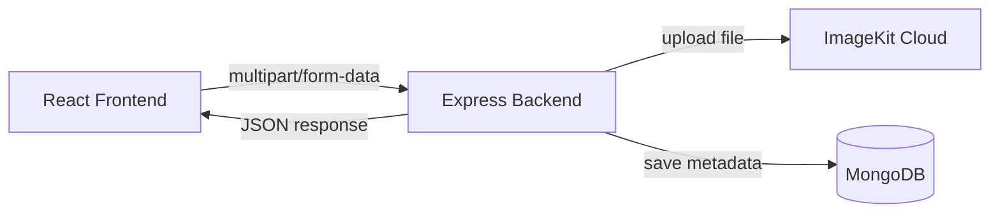

# 06 Project-1 Post App 📸

> Full-stack social post app with image upload, feed rendering, and delete flow.

Backend: Express + MongoDB + ImageKit  
Frontend: React + Vite

---

## ✨ Project Highlights

- 🖼 Upload image + caption as a new post
- ☁ Store media in ImageKit cloud
- 🗃 Store post metadata in MongoDB
- 📰 Fetch and render post feed
- 🗑 Delete post from both DB and cloud storage

---

## 🧭 Table of Contents

1. [Architecture Overview](#-architecture-overview)
2. [How This Project Is Built (Sequence)](#-how-this-project-is-built-sequence)
3. [Folder Map with Links](#-folder-map-with-links)
4. [Tech Stack and Why It Is Used](#-tech-stack-and-why-it-is-used)
5. [Environment Variables](#-environment-variables)
6. [API Documentation](#-api-documentation)
7. [Frontend Flow](#-frontend-flow)
8. [Run Locally](#-run-locally)
9. [Important Concepts](#-important-concepts)
10. [Known Caveats and Next Improvements](#-known-caveats-and-next-improvements)

---

## 🏗 Architecture Overview



High-level request lifecycle:
1. User selects image + enters caption on frontend.
2. Frontend sends FormData request to backend.
3. Backend uploads image buffer to ImageKit.
4. Backend saves ImageKit URL + fileId + caption in MongoDB.
5. Feed API returns posts for UI rendering.

---

## 🧩 How This Project Is Built (Sequence)

### 1) Backend server boot
- [Backend/server.js](Backend/server.js) starts app and connects database.

### 2) App middleware setup
- [Backend/src/app.js](Backend/src/app.js) configures:
  - CORS
  - JSON parser
  - Multer memory storage for file uploads

### 3) Database connection
- [Backend/src/db/db.js](Backend/src/db/db.js) connects with MONGO_URI.

### 4) Data model
- [Backend/src/models/post.model.js](Backend/src/models/post.model.js) stores:
  - fileId
  - image URL
  - caption

### 5) Storage service integration
- [Backend/src/services/storage.service.js](Backend/src/services/storage.service.js) handles upload and delete on ImageKit.

### 6) API endpoints in backend
- POST /create-post
- GET /posts
- DELETE /delete-post/:id

### 7) Frontend routes
- [Frontend/src/App.jsx](Frontend/src/App.jsx) defines:
  - / -> Feed
  - /create -> Create Post

### 8) Frontend pages
- [Frontend/src/pages/CreatePost.jsx](Frontend/src/pages/CreatePost.jsx): upload form
- [Frontend/src/pages/Feed.jsx](Frontend/src/pages/Feed.jsx): fetch and display posts

---

## 🗂 Folder Map with Links

### Backend
- [Backend/server.js](Backend/server.js)
- [Backend/src/app.js](Backend/src/app.js)
- [Backend/src/db/db.js](Backend/src/db/db.js)
- [Backend/src/models/post.model.js](Backend/src/models/post.model.js)
- [Backend/src/services/storage.service.js](Backend/src/services/storage.service.js)
- [Backend/package.json](Backend/package.json)

### Frontend
- [Frontend/src/main.jsx](Frontend/src/main.jsx)
- [Frontend/src/App.jsx](Frontend/src/App.jsx)
- [Frontend/src/components/Navbar.jsx](Frontend/src/components/Navbar.jsx)
- [Frontend/src/pages/CreatePost.jsx](Frontend/src/pages/CreatePost.jsx)
- [Frontend/src/pages/Feed.jsx](Frontend/src/pages/Feed.jsx)
- [Frontend/package.json](Frontend/package.json)

---

## 🧰 Tech Stack and Why It Is Used

### Backend
1. Express: build API routes and middleware pipeline.
2. Mongoose: model schema and CRUD over MongoDB.
3. Multer: parse multipart file requests.
4. ImageKit SDK: cloud media upload/delete.
5. CORS: allow frontend to call backend from another origin.
6. dotenv: load secure env config.

### Frontend
1. React: UI rendering.
2. React Router: page-level routing.
3. Axios: API requests.
4. Vite: fast local dev and build tooling.

---

## 🌍 Environment Variables

Create file: [Backend/.env](Backend/.env)

```env
MONGO_URI=your_mongodb_connection_string
IMAGEKIT_PRIVATE_KEY=your_imagekit_private_key
IMAGEKIT_PUBLIC_KEY=your_imagekit_public_key
IMAGEKIT_URL_ENDPOINT=your_imagekit_url_endpoint
```

---

## 📡 API Documentation

Base URL: http://localhost:3000

| Method | Endpoint | Description | Body |
|---|---|---|---|
| POST | /create-post | Upload image and create post | multipart: image, caption |
| GET | /posts | Fetch all posts | none |
| DELETE | /delete-post/:id | Delete post and ImageKit file | id is fileId |

### POST /create-post

Request type:
- multipart/form-data

Fields:
1. image (file)
2. caption (text)

Success response (201):
```json
{
  "message": "Post created",
  "result": {
    "fileId": "...",
    "url": "..."
  }
}
```

### GET /posts

Success response (200):
```json
{
  "message": "Posts retrieved",
  "posts": []
}
```

### DELETE /delete-post/:id

Important:
- Current implementation finds post by fileId.
- So pass ImageKit fileId as route param.

---

## 🖥 Frontend Flow

1. User opens feed route /.
2. Feed page requests GET /posts.
3. User opens create route /create.
4. Create page submits FormData to POST /create-post.
5. On success, post appears in feed.

---

## ▶ Run Locally

### 1) Start backend
```bash
cd Backend
npm install
npm run dev
```

### 2) Start frontend
```bash
cd Frontend
npm install
npm run dev
```

### 3) Open app
- Frontend: http://localhost:5173
- Backend API: http://localhost:3000

---

## 🧠 Important Concepts

1. Multer memory storage keeps uploaded file in RAM buffer.
2. ImageKit fileId is used for cloud delete operations.
3. Database stores metadata, not binary image bytes.
4. CORS is required for localhost frontend-backend communication.

---

## ⚠ Known Caveats and Next Improvements

1. In [Frontend/src/pages/CreatePost.jsx](Frontend/src/pages/CreatePost.jsx), API URL uses //localhost:3000/create-post. Prefer explicit http://localhost:3000/create-post.
2. Add robust validation for caption length and allowed file types.
3. Add centralized error middleware in backend.
4. Add pagination for feed API.
5. Add authentication and user ownership on posts.

---

## ✅ Quick Success Checklist

- Backend starts and connects MongoDB
- Frontend starts on Vite
- New post uploads successfully
- Feed returns saved posts
- Delete removes both DB record and cloud file
