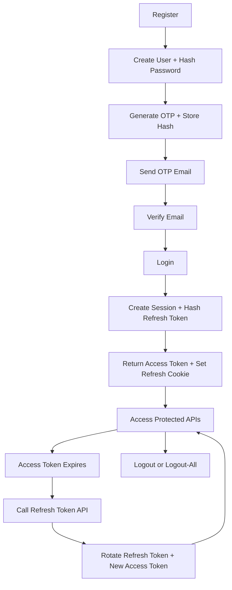

# 🔐 10 Auth Project

> <u>Production-style authentication backend</u> built with Express + MongoDB + JWT + Refresh Sessions + OTP Email Verification.

This project is designed to teach and implement a full auth lifecycle:
- ✅ Register user
- ✅ Send OTP on email
- ✅ Verify email account
- ✅ Login with access + refresh token
- ✅ Refresh token rotation
- ✅ Logout (single session)
- ✅ Logout all devices

---

## 📚 Table of Contents

1. [Project Goal](#-project-goal)
2. [Tech Stack](#-tech-stack)
3. [Folder Map](#-folder-map)
4. [Build Sequence (How Project Is Built)](#-build-sequence-how-project-is-built)
5. [Authentication Flow](#-authentication-flow)
6. [Hard Concepts Explained](#-hard-concepts-explained)
7. [Environment Variables](#-environment-variables)
8. [Run Locally](#-run-locally)
9. [API Documentation](#-api-documentation)
10. [Collections and Data Model](#-collections-and-data-model)
11. [Testing Sequence (Postman/Thunder)](#-testing-sequence-postmanthunder)
12. [Implementation Notes (Current Code)](#-implementation-notes-current-code)
13. [Improvement Roadmap](#-improvement-roadmap)

---

## 🎯 Project Goal

Build a realistic auth backend where:
- Passwords are never stored in plain text.
- Email must be verified before login.
- Access token is short-lived.
- Refresh token is stored in cookie and rotated securely.
- Sessions are revocable per device and globally.

---

## 🧰 Tech Stack

### Core
- Node.js
- Express
- MongoDB + Mongoose

### Security/Auth
- bcryptjs (password and refresh-token hashing)
- jsonwebtoken (access + refresh token)
- cookie-parser (read cookies)

### Email/OTP
- nodemailer (send OTP emails)

### Dev Utilities
- dotenv
- nodemon

See dependencies in [package.json](package.json).

---

## 🗂 Folder Map

- [server.js](server.js) - bootstraps DB + HTTP server
- [src/app.js](src/app.js) - express app + middleware + route mount
- [src/config/config.js](src/config/config.js) - env loading + config export
- [src/config/database.js](src/config/database.js) - mongoose connection
- [src/routes/auth.routes.js](src/routes/auth.routes.js) - auth endpoints
- [src/controllers/auth.controller.js](src/controllers/auth.controller.js) - auth business logic
- [src/models/user.model.js](src/models/user.model.js) - user schema
- [src/models/session.model.js](src/models/session.model.js) - refresh session schema
- [src/models/otp.model.js](src/models/otp.model.js) - otp schema
- [src/services/email.service.js](src/services/email.service.js) - mail transport + send
- [src/utils/otp.util.js](src/utils/otp.util.js) - OTP generation and HTML template

---

## 🏗 Build Sequence (How Project Is Built)

### 1) Server bootstrap
1. App is imported from [src/app.js](src/app.js).
2. DB is connected using [src/config/database.js](src/config/database.js).
3. Server starts on configured PORT from [src/config/config.js](src/config/config.js).

### 2) App-level middleware
1. `express.json()` for JSON body parsing.
2. `cookieParser()` for token cookies.
3. `/api/auth` route mounted from [src/routes/auth.routes.js](src/routes/auth.routes.js).

### 3) Config and environment
1. dotenv loads `.env` in [src/config/config.js](src/config/config.js).
2. Critical vars validated (`MONGO_URI`, `JWT_SECRET`).

### 4) Database models
1. User model: identity + role + password + verified flag.
2. Session model: hashed refresh token + device info + revoke flag.
3. OTP model: hashed OTP + user reference.

### 5) Registration pipeline
1. Validate user input.
2. Normalize username and email.
3. Check duplicates.
4. Hash password.
5. Create user.
6. Generate OTP and hash OTP.
7. Save OTP.
8. Send email.

### 6) Verification pipeline
1. Receive email + otp.
2. Find latest OTP entry.
3. Compare entered OTP with hash.
4. Mark user as verified.
5. Remove OTP docs.

### 7) Login pipeline
1. Validate credentials.
2. Find user with password selection.
3. Reject unverified user.
4. Compare password.
5. Create refresh token (7d).
6. Hash refresh token and store session.
7. Create access token (15m).
8. Set refresh token cookie.

### 8) Refresh pipeline
1. Read refresh cookie.
2. Verify refresh JWT.
3. Find active session.
4. Compare incoming refresh token with stored hash.
5. Issue new access token.
6. Rotate refresh token and update DB hash.

### 9) Logout pipeline
- Single logout: revoke one session + clear cookie.
- Logout all: revoke all sessions for user + clear cookie.

---

## 🔄 Authentication Flow



---

## 🧠 Hard Concepts Explained

### 1) Why `password` has `select: false`
In [src/models/user.model.js](src/models/user.model.js), password is hidden by default so accidental leaks are avoided. Login explicitly does `.select('+password')`.

### 2) Why refresh token is hashed in DB
In [src/controllers/auth.controller.js](src/controllers/auth.controller.js), refresh token is hashed before storing in sessions collection. If DB leaks, raw refresh tokens are still not exposed.

### 3) Why access token is short-lived
Access token is 15 minutes, reducing misuse window. Long-lived session continuity is handled by refresh token rotation.

### 4) Why session table exists
Session docs allow revocation by device and all-devices logout behavior. Stateless JWT alone cannot easily support this control.

### 5) Why OTP is hashed
OTP hash in [src/models/otp.model.js](src/models/otp.model.js) ensures plain OTP is not stored in DB.

---

## 🌍 Environment Variables

Create `.env` in project root:

```env
NODE_ENV=development
PORT=3000
MONGO_URI=mongodb://127.0.0.1:27017/auth-project
JWT_SECRET=replace_with_a_strong_secret

# Email sender identity
GOOGLE_USER=your_email@gmail.com

# Option A: Gmail App Password
GOOGLE_APP_PASSWORD=your_app_password

# Option B: OAuth2 (if not using app password)
GOOGLE_CLIENT_ID=
GOOGLE_CLIENT_SECRET=
GOOGLE_REDIRECT_URI=https://developers.google.com/oauthplayground
GOOGLE_REFRESH_TOKEN=
```

Email logic is in [src/services/email.service.js](src/services/email.service.js).

---

## ▶️ Run Locally

```bash
npm install
npm run dev
```

Server base URL:

```txt
http://localhost:3000
```

Auth base URL:

```txt
http://localhost:3000/api/auth
```

---

## 📡 API Documentation

Base path: `/api/auth`

### 1) Register
- Method: `POST`
- Route: `/register`
- Body:

```json
{
  "fullName": "John Doe",
  "username": "john_doe",
  "email": "john@example.com",
  "password": "Password123",
  "role": "user"
}
```

### 2) Verify Email
- Method: `GET`
- Route: `/verify-email`
- Current controller expects body:

```json
{
  "email": "john@example.com",
  "otp": "123456"
}
```

### 3) Login
- Method: `POST`
- Route: `/login`
- Body (username or email):

```json
{
  "username": "john_doe",
  "password": "Password123"
}
```

or

```json
{
  "email": "john@example.com",
  "password": "Password123"
}
```

Response includes:
- `accessToken` in JSON
- `refreshToken` in cookie

### 4) Get Current User
- Method: `GET`
- Route: `/get-me`
- Header:

```txt
Authorization: Bearer <access_token>
```

### 5) Refresh Access Token
- Method: `GET`
- Route: `/refresh-token`
- Requires `refreshToken` cookie.

### 6) Logout (single session)
- Method: `GET`
- Route: `/logout`
- Requires `refreshToken` cookie.

### 7) Logout All Devices
- Method: `GET`
- Route: `/logout-all`
- Requires `refreshToken` cookie.

Route map source: [src/routes/auth.routes.js](src/routes/auth.routes.js).

---

## 🗃 Collections and Data Model

### `users`
Defined in [src/models/user.model.js](src/models/user.model.js):
- fullName
- username (unique)
- email (unique)
- role (`user` or `admin`)
- password (hidden by default)
- verified
- timestamps

### `sessions`
Defined in [src/models/session.model.js](src/models/session.model.js):
- user
- refreshToken (hashed)
- ip
- userAgent
- revoke
- timestamps

### `otps`
Defined in [src/models/otp.model.js](src/models/otp.model.js):
- email
- user
- otpHash
- timestamps

---

## 🧪 Testing Sequence (Postman/Thunder)

1. Register user via `POST /register`.
2. Read OTP from email inbox.
3. Verify via `GET /verify-email` with body.
4. Login via `POST /login`.
5. Save returned access token.
6. Ensure cookie jar is enabled (refresh cookie must persist).
7. Call `GET /get-me` with Bearer token.
8. Call `GET /refresh-token` to rotate token.
9. Call `GET /logout` and `GET /logout-all` to test revocation.

---

## ⚠️ Implementation Notes (Current Code)

These are important for understanding current behavior:

1. In login query, fields are currently used as `{ normalizedUsername }` and `{ normalizedEmail }` instead of `{ username: normalizedUsername }` and `{ email: normalizedEmail }` in [src/controllers/auth.controller.js](src/controllers/auth.controller.js). This can cause credential lookup failures.

2. Cookie is set with `secure: true` in login/refresh. On plain HTTP local development, browser may not store cookie.

3. `verify-email` is a GET route but consumes request body. In HTTP practice, verification endpoints are usually `POST`.

4. `sendEmail` catches internal errors and logs them. Registration might still return success even when email send fails, depending on control flow.

5. Session and OTP models reference `users`, while user model name is `user`. If you rely on populate behavior later, align refs carefully.

---

## 🚀 Improvement Roadmap

### Security
- Add rate limiting on login/register/verify endpoints.
- Add account lockout strategy after repeated failures.
- Add CSRF protection if browser clients use cookies.

### Correctness
- Fix login query key mapping issue.
- Switch verify-email endpoint to POST.
- Add OTP expiry index (TTL) and explicit expiry validation.

### API quality
- Add centralized error middleware.
- Add request validation middleware per endpoint.
- Add standard response format with consistent error codes.

### Testing
- Add Jest + Supertest integration tests for:
  - register -> verify -> login
  - refresh token rotation
  - logout and logout-all

---

## ✨ Learning Outcome

After understanding this project, you will be comfortable with:
- Password hashing and secure credential flow
- JWT access/refresh token strategy
- Session revocation design
- OTP-based email verification flow
- Structuring auth in layered Express architecture

If you want, next step can be a **Phase-2 README** with sequence diagrams for each endpoint and a fully copy-paste Postman collection JSON.
